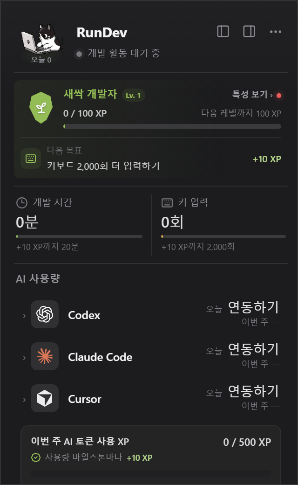
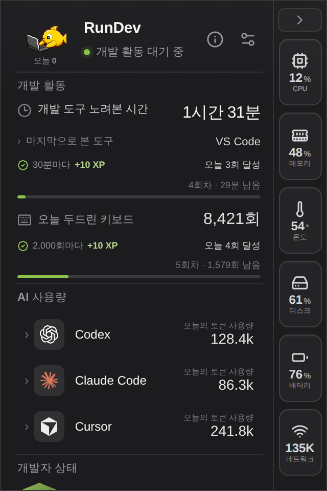
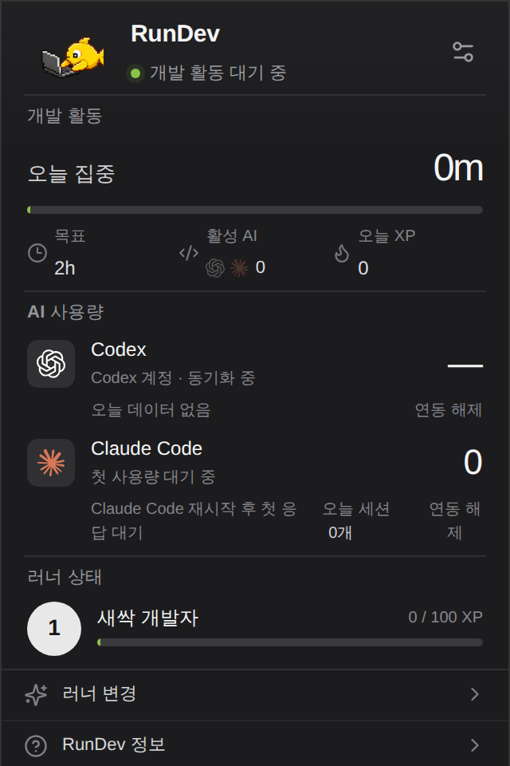
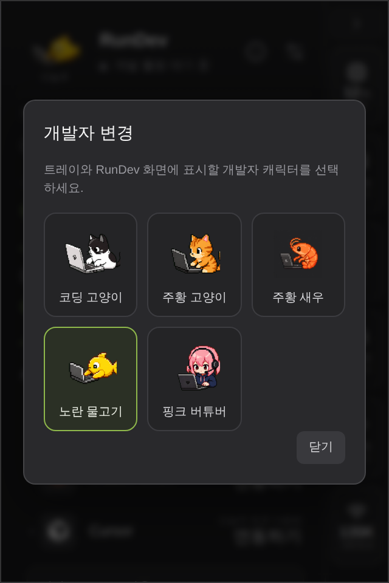
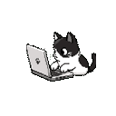
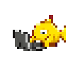

# RunDev

로컬 우선 개발 활동 컴패니언. Tauri 2, React, TypeScript, Rust, SQLite로 만든
Windows/macOS 트레이 앱입니다.

RunDev는 개발 활동과 사용자가 연결한 AI 도구의 집계 사용량을 로컬에서 기록하고,
XP와 작은 러너 캐릭터로 보여줍니다. 키 입력, 프롬프트, 응답, 소스 코드 내용은
수집하지 않습니다.

## 주요 화면

| 연동 전 | AI 활동 중 |
| --- | --- |
|  |  |
| **연동 후 데이터 대기** | **러너 변경** |
|  |  |

화면 이미지는 320×480 팝오버 크기의 고정된 미리보기 데이터로 생성됩니다. 실제
SQLite 데이터나 계정 정보는 문서 이미지 생성에 사용하지 않습니다.

## 지원 러너

| 코딩 고양이 | 주황 고양이 | 하양 고양이 | 노란 물고기 | 핑크 버튜버 |
| --- | --- | --- | --- | --- |
|  |  |  |  |  |

러너는 앱의 **러너 변경** 메뉴에서 선택하며, 헤더와 네이티브 트레이 애니메이션에
동시에 적용됩니다.

## 개발

```powershell
npm.cmd install
npm.cmd run tauri dev
```

브라우저에서 UI만 확인하려면 `npm.cmd run dev`를 사용합니다. README용 주요 화면과
러너 GIF를 로컬에서 다시 만들려면 다음 명령을 실행합니다.

```powershell
npx.cmd playwright install chromium
npm.cmd run build
npm.cmd run docs:assets
```

`main`에 UI 또는 러너 애셋 변경이 푸시되면 GitHub Actions가 이미지를 다시 만들고,
변경된 결과만 자동 커밋합니다.

## 버전

앱 버전은 여러 패키지와 번들 설정에서 동일하게 유지합니다. 직접 개별 파일을
수정하지 않고 다음 명령을 사용합니다.

```powershell
npm.cmd run version:check
npm.cmd run version:set -- 0.2.0
```

릴리스 정책과 태그 절차는 [버전과 릴리스 관리](docs/releases/versioning.md)를 참고합니다.

## 현재 구현

- 트레이 상주 및 좌클릭으로 창 토글
- 창을 닫아도 백그라운드 유지
- 단일 인스턴스와 우클릭 종료 메뉴
- 32×32 PNG 프레임 트레이 애니메이션
- 고양이 3종, 노란 물고기, 핑크 버튜버 러너 선택
- SQLite 자동 생성과 초기 마이그레이션
- Codex 계정 사용량과 Claude Code OpenTelemetry 집계
- Rust command를 통한 요약·캐릭터·AI 상태 조회
- React + Zustand 대시보드

Updater 구성은 포함하지만 서명된 공개 배포 endpoint를 발급하기 전까지 자동으로
초기화하지 않습니다.

## 문서

- [문서 인덱스](docs/README.md)
- [시스템 아키텍처](docs/architecture/overview.md)
- [ADR 인덱스](docs/decisions/README.md)
- [제품 로드맵](docs/product/roadmap.md)
- [변경 기록](CHANGELOG.md)
- [AI 및 기여자 작업 규칙](AGENTS.md)
