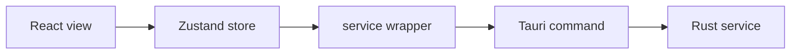

# 프론트엔드

## 책임

React는 다음 역할만 담당한다.

- 트레이 팝오버 렌더링
- 오늘 활동, AI 사용량, 캐릭터 상태 표시
- 사용자 설정 입력
- command 결과의 로딩 및 오류 상태 관리

백그라운드 수집, XP 계산, DB 쓰기를 담당하지 않는다.

## 현재 구조

```text
src/
├─ App.tsx
├─ main.tsx
├─ styles.css
├─ components/
│  └─ SystemStatusStrip.tsx
├─ services/
│  └─ rundev.ts
├─ store/
│  └─ dashboard.ts
├─ types/
│  ├─ activity.ts
│  └─ system.ts
└─ lib/
   └─ cn.ts
```

## 데이터 흐름



- Tauri 환경이 아닌 Vite 브라우저 미리보기에서는 service가 안전한 preview 데이터를
  반환한다.
- command payload는 TypeScript와 Rust 양쪽에서 camelCase 직렬화 규칙을 맞춘다.
- 화면 단위 비동기 상태는 Zustand store에 둔다.

## 디자인 원칙

- RunCat 계열 메뉴바 유틸리티의 작은 정보 패널 밀도를 따른다.
- 기본 팝오버 크기는 392×480이다 (본문 폭 유지 + 오른쪽 상태 타일 strip).
- 큰 관리자 페이지형 카드보다 구분선, 짧은 행, 얇은 meter를 사용한다.
- 초록색은 상태와 진행률 강조에만 제한적으로 사용한다.
- 기본 창에는 타이틀바와 네이티브 window control을 표시하지 않는다.

## 컴포넌트 추가 기준

- 두 화면 이상에서 반복될 때 공통 컴포넌트로 추출한다.
- shadcn/ui는 Dialog, Tabs, Switch, Tooltip, Progress, Dropdown Menu 범위에서 우선
  검토한다.
- 컴포넌트에서 직접 `invoke`하지 않는다.
- 접근 가능한 label과 keyboard interaction을 유지한다.

