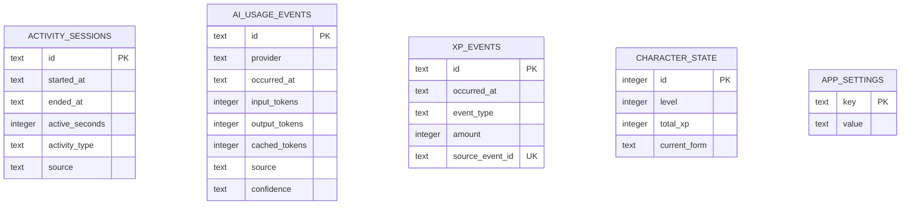

# 네이티브 백엔드

## 부팅 순서

1. tracing subscriber를 초기화한다.
2. single-instance, autostart, notification 플러그인을 등록한다.
3. 앱 데이터 디렉터리를 생성한다.
4. SQLite pool을 열고 migration을 실행한다.
5. pool을 Tauri managed state로 등록한다.
6. Claude Code 로컬 OpenTelemetry 수집기를 시작한다.
7. 트레이 메뉴와 애니메이션을 시작한다.
8. command handler를 노출한다.

Updater 의존성은 포함되어 있지만 서명키와 endpoint가 없으므로 초기화하지 않는다.

## 모듈

### `database`

- SQLite 연결 옵션과 migration 실행
- `AppState`를 통한 pool 공유
- DB 경로: OS별 Tauri app data directory의 `rundev.db`

### `commands`

- React에 노출되는 직렬화 경계
- 현재 command:
  - `get_daily_summary`
  - `get_character_state`
- 내부 오류를 현재는 문자열로 변환한다. 오류 종류가 늘어나면 안정적인 command
  error enum을 도입한다.

### `tray`

- 단일 트레이 인스턴스 생성
- 좌클릭 팝오버 위치 계산
- 우클릭 네이티브 메뉴
- PNG 프레임 애니메이션
- 향후 `CharacterAnimation` 상태 머신의 소유자가 된다.

## DB 스키마

시간은 현재 ISO-8601 문자열로 저장한다. 활동 수집 구현 시 UTC 저장과 로컬 날짜
집계 경계를 테스트로 고정해야 한다.

## 플랫폼 경계

Windows:

- `GetForegroundWindow`
- `GetWindowThreadProcessId`
- `GetLastInputInfo`
- 잠금 및 절전 이벤트

macOS:

- `NSWorkspace`
- `CGEventSource`
- 잠금 및 절전 notification
- 필요한 경우에만 Accessibility 권한

플랫폼 이벤트는 공통 도메인 타입으로 정규화한 이후 DB와 XP 엔진에 전달한다.

## AI 사용량 수집

`adapters::codex`는 별도 `codex app-server` 프로세스와 JSON-RPC로 통신한다.
앱 시작 직후와 5분 간격으로 `account/usage/read`를 호출하고 날짜별 누적값을
`ai_usage_snapshots`에 저장한다. 어댑터의 마지막 성공 시각과 오류는
`ai_adapter_state`에 저장한다.
기본 상태는 미연동이며 사용자가 UI의 연동 버튼을 누르기 전에는 Codex
프로세스를 시작하거나 계정 사용량을 조회하지 않는다.
연동 버튼은 먼저 `account/read`만 호출해 로그인 계정, 인증 방식, 요금제와
기본/사용자 지정 `CODEX_HOME` 여부를 보여준다. 사용자가 확인한 뒤에만 설정을
활성화하고 첫 사용량 동기화를 수행한다.

일별 총 토큰은 해당 날짜의 최신 공식 스냅샷을 사용한다. 향후 요청별
OpenTelemetry 이벤트를 추가하더라도 스냅샷과 이벤트 합계를 서로 더하지 않는다.
어댑터는 Codex 인증정보, 프롬프트, 응답, 원본 JSON을 저장하지 않는다.
## Claude Code 사용량 수집

`adapters/claude.rs`는 루프백 주소의 OTLP/HTTP JSON 수집기를 실행한다. 사용자가
연동한 경우에만 비밀 헤더가 일치하는 `claude_code.api_request` 로그를 받아
`ai_usage_events`에 저장한다. 프론트엔드는 SQLite나 수집기에 직접 접근하지 않고
Tauri command로 오늘 합계와 연결 상태만 조회한다.

연동과 해제는 Claude 설정의 기존 값을 보존하며, RunDev가 기록한 값이 사용자가
따로 변경되지 않았을 때에만 원래 값으로 되돌린다.
