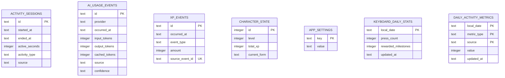

# 네이티브 백엔드

## 부팅 순서

1. tracing subscriber를 초기화한다.
2. single-instance, autostart, notification, process, updater 플러그인을 등록한다.
3. 앱 데이터 디렉터리를 생성한다.
4. SQLite pool을 열고 migration을 실행한다.
5. pool을 Tauri managed state로 등록한다.
6. 집중시간, 키보드 횟수, Claude Code 로컬 OpenTelemetry 수집기를 시작한다.
7. Codex 사용량 동기화 worker를 시작한다.
8. 동의된 Cursor 사용량 동기화 worker를 시작한다.
8. HostMetricsService(시스템 상태 strip)를 시작한다.
9. 트레이 메뉴와 애니메이션을 시작한다.
10. command handler를 노출한다.

macOS에서는 부팅 시 `ActivationPolicy::Accessory`를 설정하고, 번들
`Info.plist`에 `LSUIElement`를 넣어 Dock과 Cmd+Tab에 표시되지 않게 한다.
Windows의 `skipTaskbar`는 작업 표시줄만 제어하며 macOS Dock에는 영향을 주지
않는다.

Updater는 GitHub Releases의 `latest.json`을 endpoint로 사용한다. 공개키는
`tauri.conf.json`에 포함하고, 릴리스 서명은 GitHub Actions secret의 비밀키로
수행한다. 자세한 결정은 ADR 0013을 본다.

## 모듈

### `database`

- SQLite 연결 옵션과 migration 실행
- `AppState`를 통한 pool 공유
- DB 경로: OS별 Tauri app data directory의 `rundev.db`

### `commands`

- React에 노출되는 직렬화 경계
- 현재 command:
  - `get_daily_summary`
  - `get_character_state`
- 내부 오류를 현재는 문자열로 변환한다. 오류 종류가 늘어나면 안정적인 command
  error enum을 도입한다.

### `diagnostics`

- 앱 데이터 디렉터리의 `diagnostics/rundev-diagnostics.jsonl`에 명시적으로 허용한
  진단 이벤트만 기록
- 1 MiB 단위 회전과 현재 파일 포함 최근 3개 유지
- 키 값, 입력 순서, 창 제목, 파일 경로, 프롬프트, 응답, 계정·인증정보 기록 금지
- 자동 전송 없이 `open_diagnostics_folder` command로 사용자가 직접 폴더를 열어 공유

### `keyboard`

- Windows Raw Input 메시지 창과 macOS listen-only event tap 관리
- 자동 반복과 단독 보조키 제외
- 키 값이나 입력 순서를 보존하지 않고 횟수 신호만 일별로 저장
- 2,000회 단위 XP 원장 기록과 `daily_activity_metrics` 갱신
- 250ms 단위 `keyboard-activity-updated` 이벤트와 5초 단위 SQLite 합계 저장
- macOS Input Monitoring 권한 상태 및 설정 화면 연결
- 앱 교체 후 권한 복구 시 TCC 등록과 `keyboard.macos.permission_prompted` 안내
  상태를 함께 초기화하고 재시작 뒤 권한을 다시 요청
- macOS event tap 비활성화 이벤트를 감지해 tap을 다시 활성화

### `activity`

- Windows 실행 파일명과 macOS bundle identifier를 내장 개발 앱 카탈로그로 분류
- 1초 단위 활성 앱·idle 상태 확인과 5분 idle 중단
- 비개발 앱 전환, 화면 잠금, 날짜 변경 시 현재 세션 종료
- 실행된 tick만 누적하여 절전 중 경과 시간을 제외
- 매초 `focus-activity-updated` 이벤트와 10초 단위 SQLite 세션 갱신
- `get_focus_activity_today` command로 마지막 개발 도구와 오늘의 앱별 합계 조회
- `get_activity_history` command로 최근 20주의 날짜별 개발시간과 잔디 강도 조회
- 30분 단위 10 XP를 `focus_milestone` 원장 이벤트로 멱등 지급
- 앱 식별자 외 창 제목, 파일 경로, URL은 수집하지 않음

### `tray`

- 단일 트레이 인스턴스 생성
- 좌클릭 팝오버 위치 계산
- 우클릭 네이티브 메뉴
- PNG 프레임 애니메이션
- 향후 `CharacterAnimation` 상태 머신의 소유자가 된다.

### `host_metrics`

- CPU·메모리·온도·디스크·배터리·네트워크 활동을 표시용으로만 샘플링한다
- 앱 수명 동안 단일 루프이며 SQLite에 쓰지 않는다
- `system-stats-updated` 이벤트와 `get_system_stats` 스냅샷 command를 제공한다
- 자세한 범위는 ADR 0014를 본다

상세 패널에는 논리 CPU 수, 메모리·주 저장 장치의 전체/사용/가용 용량과 실행 후
최고 온도를 함께 제공한다. 수집 경계는 ADR 0014와 ADR 0017을 따른다.

### `whip`

- 팝오버 헤더 캐릭터 클릭의 로컬 일별 횟수만 원자 UPSERT로 저장한다
- `record_whip` / `get_whip_stats` command를 제공하며 XP·채팅·이벤트 버스와 연결하지 않는다
- 자세한 범위는 ADR 0015를 본다

## DB 스키마

시간은 현재 ISO-8601 문자열로 저장한다. 활동 수집 구현 시 UTC 저장과 로컬 날짜
집계 경계를 테스트로 고정해야 한다.

## 플랫폼 경계

Windows 집중시간:

- `GetForegroundWindow`
- `GetWindowThreadProcessId`
- `GetLastInputInfo`
- `GetTickCount`
- `LockApp.exe`와 `LogonUI.exe` 잠금 화면 판별

macOS 집중시간:

- `NSWorkspace`
- `CGEventSource`
- `loginwindow` 잠금 화면 판별
- 활성 앱 분류와 idle 조회에는 Accessibility 권한이 필요하지 않음

현재 두 플랫폼 모두 1초 polling 결과를 공통 도메인 타입으로 정규화한다. Tokio의
`MissedTickBehavior::Skip`을 사용하므로 절전 중 누락된 tick을 깨어난 뒤 몰아서
집계하지 않는다.

## AI 사용량 수집

`adapters::codex`는 별도 `codex app-server` 프로세스와 JSON-RPC로 통신한다.
앱 시작 직후와 5분 간격으로 `account/usage/read`를 호출하고 날짜별 누적값을
`ai_usage_snapshots`에 저장한다. 어댑터의 마지막 성공 시각과 오류는
`ai_adapter_state`에 저장한다.
기본 상태는 미연동이며 사용자가 UI의 연동 버튼을 누르기 전에는 Codex
프로세스를 시작하거나 계정 사용량을 조회하지 않는다.
연동 버튼은 먼저 `account/read`만 호출해 로그인 계정, 인증 방식, 요금제와
기본/사용자 지정 `CODEX_HOME` 여부를 보여준다. 사용자가 확인한 뒤에만 설정을
활성화하고 첫 사용량 동기화를 수행한다.

일별 총 토큰은 해당 날짜의 최신 공식 스냅샷을 사용한다. 향후 요청별
OpenTelemetry 이벤트를 추가하더라도 스냅샷과 이벤트 합계를 서로 더하지 않는다.
어댑터는 Codex 인증정보, 프롬프트, 응답, 원본 JSON을 저장하지 않는다.

## Cursor 사용량 동기화

Cursor 어댑터는 동의와 연동이 모두 활성화된 경우에만 로컬 로그인 DB의 인증 key
하나를 read-only로 읽는다. 네트워크 클라이언트는 redirect를 차단하고
`cursor.com`의 고정 endpoint만 호출한다. 계정·오늘 집계·현재 주기 한도 결과는
계정별 스냅샷으로 저장하며 인증정보와 원본 응답은 저장하지 않는다.

백그라운드 주기는 300초다. 트레이에서 팝오버를 표시할 때는 60초 최소 간격과
single-flight를 적용해 Codex와 Cursor를 병렬 갱신한다.
## Claude Code 사용량 수집

`adapters/claude.rs`는 루프백 주소의 OTLP/HTTP JSON 수집기를 실행한다. 사용자가
연동한 경우에만 비밀 헤더가 일치하는 `claude_code.api_request` 로그를 받아
`ai_usage_events`에 저장한다. 프론트엔드는 SQLite나 수집기에 직접 접근하지 않고
Tauri command로 오늘 합계와 연결 상태만 조회한다.

연동과 해제는 Claude 설정의 기존 값을 보존하며, RunDev가 기록한 값이 사용자가
따로 변경되지 않았을 때에만 원래 값으로 되돌린다.
