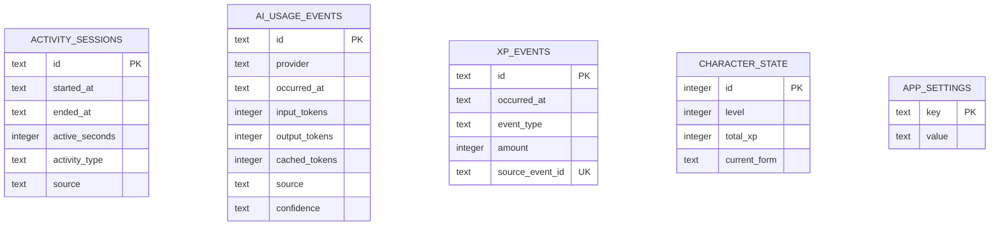

# 네이티브 백엔드

## 부팅 순서

1. tracing subscriber를 초기화한다.
2. single-instance, autostart, notification 플러그인을 등록한다.
3. 앱 데이터 디렉터리를 생성한다.
4. SQLite pool을 열고 migration을 실행한다.
5. pool을 Tauri managed state로 등록한다.
6. 트레이 메뉴와 애니메이션을 시작한다.
7. command handler를 노출한다.

Updater 의존성은 포함되어 있지만 서명키와 endpoint가 없으므로 초기화하지 않는다.

## 모듈

### `database`

- SQLite 연결 옵션과 migration 실행
- `AppState`를 통한 pool 공유
- DB 경로: OS별 Tauri app data directory의 `rundev.db`

### `commands`

- React에 노출되는 직렬화 경계
- 현재 command:
  - `get_daily_summary`
  - `get_character_state`
- 내부 오류를 현재는 문자열로 변환한다. 오류 종류가 늘어나면 안정적인 command
  error enum을 도입한다.

### `tray`

- 단일 트레이 인스턴스 생성
- 좌클릭 팝오버 위치 계산
- 우클릭 네이티브 메뉴
- PNG 프레임 애니메이션
- 향후 `CharacterAnimation` 상태 머신의 소유자가 된다.

## DB 스키마

시간은 현재 ISO-8601 문자열로 저장한다. 활동 수집 구현 시 UTC 저장과 로컬 날짜
집계 경계를 테스트로 고정해야 한다.

## 플랫폼 경계

Windows:

- `GetForegroundWindow`
- `GetWindowThreadProcessId`
- `GetLastInputInfo`
- 잠금 및 절전 이벤트

macOS:

- `NSWorkspace`
- `CGEventSource`
- 잠금 및 절전 notification
- 필요한 경우에만 Accessibility 권한

플랫폼 이벤트는 공통 도메인 타입으로 정규화한 이후 DB와 XP 엔진에 전달한다.

