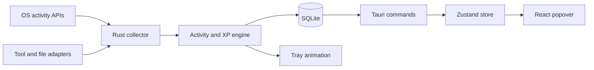
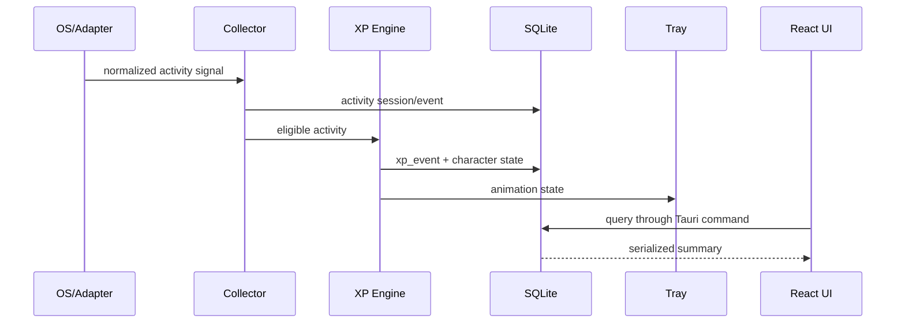

# 시스템 아키텍처

## 목표

RunDev는 개발 활동을 로컬에서 측정하고 XP와 캐릭터 상태로 변환하는 트레이 상주
앱이다. React 화면이 닫혀 있어도 수집, 계산, 저장, 트레이 애니메이션은 계속
동작해야 한다.

## 컨테이너 구조



## 프로세스 모델

RunDev는 하나의 Tauri 프로세스로 실행된다.

```text
RunDev process
├─ Tauri main thread
│  ├─ tray icon and native menu
│  └─ hidden/visible WebView lifecycle
├─ Tokio runtime
│  ├─ tray animation timer
│  ├─ foreground development activity collector
│  ├─ keyboard count collector
│  └─ AI adapter workers
├─ sqlx SQLite pool
└─ React WebView (visible only while popover is open)
```

## 현재 구현

- 단일 인스턴스
- 트레이 좌클릭 팝오버와 우클릭 메뉴
- 4프레임 coding 애니메이션
- 팝오버 헤더 개발자 캐릭터 채찍질(로컬 일별 횟수)
- SQLite 생성 및 migration
- 활성 개발 앱과 5분 idle 기준의 집중시간 세션 수집
- 키보드 입력 횟수 수집
- Codex 및 Claude Code 사용량 연동
- 오늘 요약과 캐릭터 상태 command
- Zustand 기반 React 대시보드

## 주요 모듈

```text
src-tauri/src/
├─ activity/
│  ├─ catalog.rs
│  ├─ windows.rs
│  └─ macos.rs
├─ adapters/
│  ├─ codex.rs
│  ├─ claude.rs
│  ├─ cursor.rs
│  └─ ollama.rs
├─ xp/
│  ├─ engine.rs
│  └─ rules.rs
├─ database/
├─ tray/
└─ commands/
```

`activity`는 OS 상태를 공통 집중 세션으로 정규화한다. `xp`와 아직 구현하지 않은
어댑터 폴더는 실제 기능을 추가할 때만 만든다.

## 핵심 데이터 흐름



React가 DB에 직접 연결되는 화살표는 허용하지 않는다.
