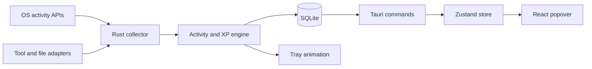
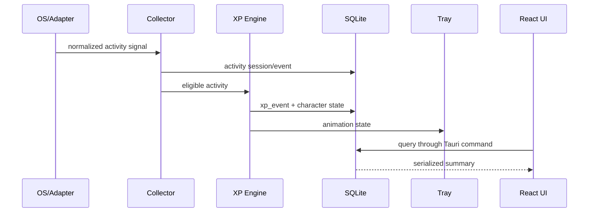

# 시스템 아키텍처

## 목표

RunDev는 개발 활동을 로컬에서 측정하고 XP와 캐릭터 상태로 변환하는 트레이 상주
앱이다. React 화면이 닫혀 있어도 수집, 계산, 저장, 트레이 애니메이션은 계속
동작해야 한다.

## 컨테이너 구조



## 프로세스 모델

RunDev는 하나의 Tauri 프로세스로 실행된다.

```text
RunDev process
├─ Tauri main thread
│  ├─ tray icon and native menu
│  └─ hidden/visible WebView lifecycle
├─ Tokio runtime
│  ├─ tray animation timer
│  ├─ future activity collector
│  └─ future adapter workers
├─ sqlx SQLite pool
└─ React WebView (visible only while popover is open)
```

## 현재 구현

- 단일 인스턴스
- 트레이 좌클릭 팝오버와 우클릭 메뉴
- 4프레임 coding 애니메이션
- SQLite 생성 및 migration
- 오늘 요약과 캐릭터 상태 command
- Zustand 기반 React 대시보드

## 계획된 모듈

```text
src-tauri/src/
├─ activity/
│  ├─ detector.rs
│  ├─ idle.rs
│  ├─ windows.rs
│  └─ macos.rs
├─ adapters/
│  ├─ codex.rs
│  ├─ claude.rs
│  ├─ cursor.rs
│  └─ ollama.rs
├─ xp/
│  ├─ engine.rs
│  └─ rules.rs
├─ database/
├─ tray/
└─ commands/
```

계획된 폴더는 구현할 기능이 생길 때 추가한다. 빈 추상화나 빈 모듈을 미리 만들지
않는다.

## 핵심 데이터 흐름



React가 DB에 직접 연결되는 화살표는 허용하지 않는다.

